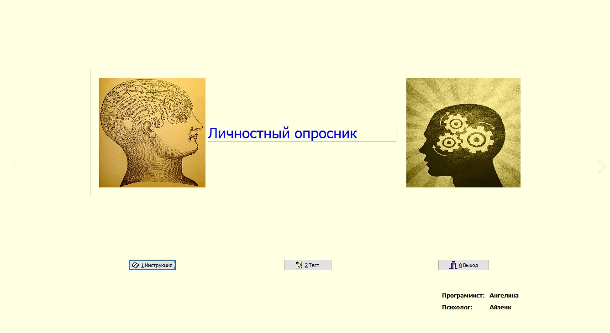
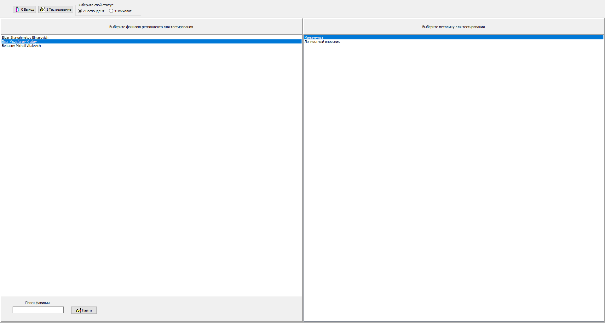
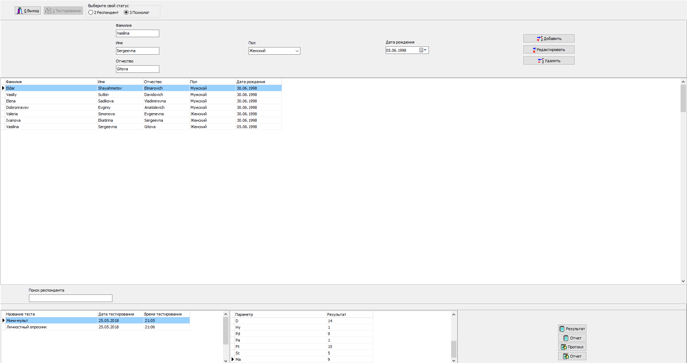
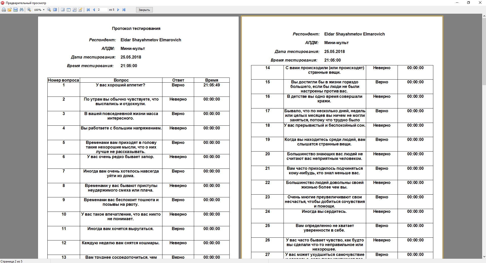
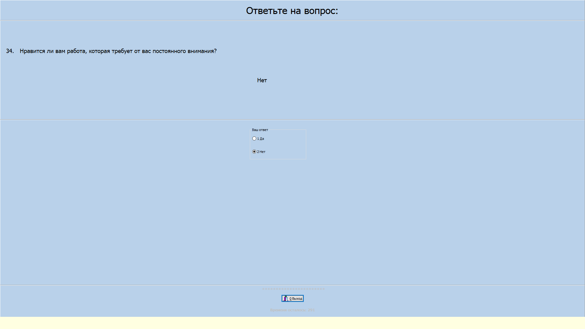

# Psychological-tests
(Delphi) Psychological tests with shell, database and reports

# Basic Overview
Program is a shell with 2 psychological tests. 
Patients can choose their names and tests they want to pass.
Shell allows you to loggin as a psychologist and manage patients information, 
also you can watch results and protocols. You can get reports created by fast report.

```You can get full description at any time the program works by clicking F1```



## Getting Started
These instructions will get you a copy of the project up and running on your local machine for development and testing purposes.

### Prerequisites
```
Borland Delphi 7 -> https://www.delphiautoparts.com/ru/russia-homepage
Installed Fast Report module -> https://www.fastreport.ru/ru/
```
### Installing
```
You can instal program through installer PsyTest.exe
```

### Psychological code - 12345

# Shell

```Shell allows patients pass the proposed tests```

Choose your name in a list and then choose test to pass.



---
```Login as Psychologist to access results and protocols```

You can add, edit and remove patients also you can watch their resutlts and protocols.



# Reports

```You can get reoports and protocols of each patient for printing```

Just click the buttons with Notepad image like in image above.



# Tests

```Take the tests after reading the instructions```

Choose answers with mouse or with 1 2 3 4 5 buttons. Press F1 to get instructions.



# Authors

* Eldar Shayahmetov, eldarsharpey@gmail.com

